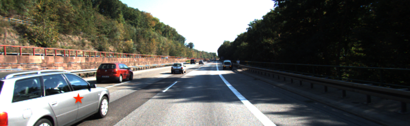
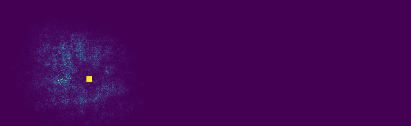

# Semseg-MonoDepth-Pytorch
CNNs for semantic segmentation and monocular depth estimation in Pytorch with cross task experiments, 
with pixel-wise saliency maps for evaluation of differences in activation range and activation density between two tasks


# Semantic segmentation
* [FCN](https://arxiv.org/abs/1411.4038) 
* [FRRN A](https://arxiv.org/abs/1611.08323)
* [SegNet](https://arxiv.org/abs/1511.00561)
* [DeepLab v2](https://arxiv.org/abs/1606.00915)

# Monocular Depth Estimation 
* [DispNet](https://arxiv.org/pdf/1512.02134.pdf)
* [FCRN](https://arxiv.org/pdf/1512.02134.pdf)

# Cross experiments between two tasks:
Test above 6 networks both for semantic segmentation and monocular depth estimation. 
Segmentation evaluated on Cityscapes and KITTI semantics, monocular depth estimation evaluated on KITTI raw data.

# Dataloaders for seg and depth
* [Cityscapes](https://www.cityscapes-dataset.com/) (only implemented for segmentation)
* [KITTI](http://www.cvlibs.net/datasets/kitti/raw_data.php) (for segmentation and depth)

# Usage
## config file
Augmentation and lr_schedule are both set to None in our experiments, so they are not tested. Just list them here in case you need it. 
```yaml
# Model Configuration
model:
    arch: <name> [options: 'fcn8s, frrn[A,B], segnet, deeplab, dispnet, fcrn'
    <model_keyarg_1>:<value>
task: [options: 'seg', 'depth']
# Data Configuration
data:
    dataset: <name> [options: 'cityscapes, kitti'] 
    train_split: <split_to_train_on>
    val_split: <split_to_validate_on>
    test_split: <split_to_test_on>
    img_rows: <img_height>
    img_cols: <img_width>
    path: <path/to/data>

# Training Configuration
training:
    train_iters: 200000
    batch_size: 2
    val_interval: 1500
    n_workers: 2
    print_interval: 300
    loss:
        name: <loss_type> [options for seg: 'cross_entropy, bootstrapped_cross_entropy'][options for depth: 'l1_loss', 'berhu_loss', 'huber_loss', 'scale_invariant_loss']
        <loss_keyarg1>:<value>
    
    # Optmizer Configuration
    optimizer:
        name: <optimizer_name> [options: 'sgd, adam, adamax, asgd, adadelta, adagrad, rmsprop']
        lr: 1.0e-4
        <optimizer_keyarg1>:<value>   
       
    # Augmentations Configuration
    augmentations:
        gamma: x                                     #[gamma varied in 1 to 1+x]
        hue: x                                       #[hue varied in -x to x]
        brightness: x                                #[brightness varied in 1-x to 1+x]
        saturation: x                                #[saturation varied in 1-x to 1+x]
        contrast: x                                  #[contrast varied in 1-x to 1+x]
        rcrop: [h, w]                                #[crop of size (h,w)]
        translate: [dh, dw]                          #[reflective translation by (dh, dw)]
        rotate: d                                    #[rotate -d to d degrees]
        scale: [h,w]                                 #[scale to size (h,w)]
        ccrop: [h,w]                                 #[center crop of (h,w)]
        hflip: p                                     #[flip horizontally with chance p]
        vflip: p                                     #[flip vertically with chance p]


    # LR Schedule Configuration
    lr_schedule:
        name: <schedule_type> [options: 'constant_lr, poly_lr, multi_step, cosine_annealing, exp_lr']
        <scheduler_keyarg1>:<value>

    # Resume from checkpoint  
    resume: <path_to_checkpoint>

testing:
    trained_model: <path_to_model_for_test>

```

## Prepare KITTI training data for depth estimation
Compute depth ground truth for KITTI raw data, leading to around 44k images, 30k for training and 14k for validation
```
python kitti_train_depth_prepare/prepare_train_data.py --dataset_dir /path/to/raw/kitti/dataset/ --dump-root /path/to/resulting/formatted/data/ --width 832 --height 256 --num-threads 4 [--static-frames /path/to/static_frames.txt] 

```

## For training (segmentation and depth):
```
python train.py --config path/to/configFile 
```

## For segmentation validation:
For Cityscapes: evaluation on the official validation set
For KITTI: split 20% of the training set for validation
```
python validate_seg.py  --config path/to/config/file  --model_path path/to/trained/model
```

## For depth test:
Evaluated on Eigen test split of 697 images:
```
python test_depth_kitti.py --model_name MODEL_NAME --model_path path/to/model --img_height 256 --img_width 832 --dataset_dir path/to/kitti/raw/data --dataset_list path/to/test/data/list/file [--pred_disp] 

  --model_name   options: ["fcn", "frrnA", "segnet", "deeplab", "dispnet", "fcrn"]
  --pred_disp    only set for dispnet
```
Evaluated on cityscapes test set of 1532 images:
```
python test_depth_cityscapes.py --config path/to/configFile 

  --config        config file includes model name, task, model path, etc., set 'test_split' argument to 'test' and trained_model argument
```
Here the img_height and img_width need to match the training settings of the evaluated model.


## Pixel-wise saliency map visulization
We compute a saliency map for a target pixel, to represent whether each pixel in the input image 
is utilized by the model to predict value for the target pixel. Below is an example. 
In the example, the red star is the target pixel in the input image, and the yellow point in the saliency map. 
(for a clearer visualization of target pixel location)

 

run the code to get saliency map for a certain pixel in an input image.
```
python demo_saliency.py --image_path /path/to/an/image --model_name fcn --task seg --model_path /path/to/trained/model --height 256 --width 832 --pos_i 80 --pos_j 100 

  --model_name    options: ["fcn", "frrnA", "segnet", "deeplab", "dispnet", "fcrn"]
  --task          options: ["seg", "depth"]
  --pos_i         y_coordinate for the target pixel
  --pos_j         x_coordinate for the target pixel
```

## pixel-wise saliency map evaluation
We compute a saliency map for pixel pixel by all models we trained on KITTI segmentation and depth.
Three metrics are designed for evaluation and we find out depth estimation pixels with a larger range 
with a larger activation density than segmentation from the input image, i.e., extract more input information.
Run saliency_analysis.py to get saliency evaluation results analysis and histogram visualization.

```
python saliency_eval.py --model_name fcn --task seg --model_path /path/to/trained/model --height 256 --width 832 --sample_rate 4 --num_image 100

  --model_name    options: ["fcn", "frrnA", "segnet", "deeplab", "dispnet", "fcrn"]
  --task          options: ["seg", "depth"]
  --num_image     number of pixels to evaluate
  --sample_rate   sample one pixel to calculate saliency map every 4 pixels in x-direction and y-direction in the image
```
```
python saliency_iou.py --model_name fcn --model_seg_path /path/to/trained/seg/model --model_depth_path /path/to/trained/depth/model --height 256 --width 832 --sample_rate 4 --num_image 100
```

## segmentation / depth estimation results
Segmentation results are evaluated on Cityscapes validation set and KITTI semantics validation set.
Depth results are evaluated on Eigen split test set from KITTI raw data.

Segmentation on Cityscapes val set:

|             |     FCN    |  SegNet    | FRRN A  | DeepLab v2 |   FCRN    |  DispNet  |
|-------------|:----------:|:----------:|:-------:|:----------:|:---------:|:---------:|
| batch size  |    2       |     2      | 3       |   4        |       4   |     4     |
| mIoU        |  67.2%     |    59.0%   |  64.2%  |     68.6%  |    64.9%  |    51.0%  |

Segmentation on KITTI semantics val set with resolution 256*832 and batch size 4:

|             |     FCN    |  SegNet    | FRRN A  | DeepLab v2 |   FCRN    |  DispNet  |
|-------------|:----------:|:----------:|:-------:|:----------:|:---------:|:---------:|
| mIoU        |  64.6%     |    52.7%   |  66.8%  |     61.8%  |    60.9%  |    45.0%  |

Monocular depth estimatino on cityscapes test set with batch size 2:

|             |     FCN    |  SegNet    | FRRN A  | DeepLab v2 |   FCRN    |  DispNet  |
|-------------|:----------:|:----------:|:-------:|:----------:|:---------:|:---------:|
| resolution  |  512*1024  |  512*1024  | 256*512 |  512*1024  |  512*1024 | 512*1024  |
|   rel       |  0.109     |    0.122   |  0.117  |     0.109  |    0.109  |    0.160  |
|   sq_rel    |  1.041     |    1.281   |  1.297  |     0.976  |    1.045  |    2.147  |
|   rms       |  6.205     |    7.227   |  6.699  |     6.016  |    6.186  |    8.405  |
|  log_rms    |  0.171     |    0.214   |  0.183  |     0.166  |    0.170  |    0.240  |
|  delta<1.25 |  0.863     |    0.836   |  0.855  |     0.871  |    0.866  |    0.777  |
| delta<1.25^2|  0.966     |    0.953   |  0.960  |     0.970  |    0.968  |    0.922  |
| delta<1.25^3|  0.990     |    0.984   |  0.987  |     0.991  |    0.990  |    0.970  |


Monocular depth estimation on KITTI Eigen split with resolution 256*832 and batch size 4:

|             |     FCN    |  SegNet    | FRRN A  | DeepLab v2 |   FCRN    |  DispNet  |
|-------------|:----------:|:----------:|:-------:|:----------:|:---------:|:---------:|
|   rel       |  0.106     |    0.110   |  0.115  |     0.106  |    0.105  |    0.134  |
|   sq_rel    |  0.644     |    0.695   |  0.714  |     0.648  |    0.734  |    0.914  |
|   rms       |  4.450     |    4.738   |  4.627  |     4.381  |    5.040  |    5.024  |
|  log_rms    |  0.176     |    0.184   |  0.187  |     0.173  |    0.193  |    0.212  |
|  delta<1.25 |  0.863     |    0.854   |  0.846  |     0.869  |    0.856  |    0.818  |
| delta<1.25^2|  0.960     |    0.947   |  0.953  |     0.962  |    0.953  |    0.939  |
| delta<1.25^3|  0.987     |    0.985   |  0.985  |     0.988  |    0.982  |    0.977  |

See specific preprocessing procedure in the data loaders. 

# References
This repo benefits a lot from:
https://github.com/meetshah1995/pytorch-semseg
and 
https://github.com/ClementPinard/SfmLearner-Pytorch, many thanks to authors of them. 

